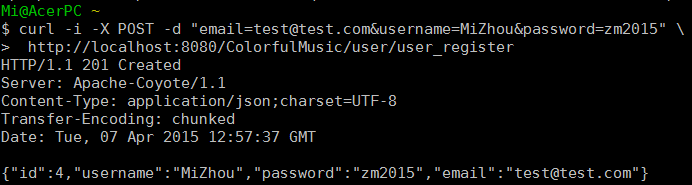
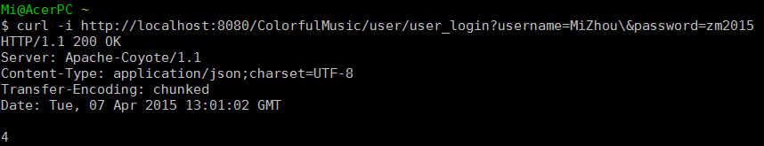
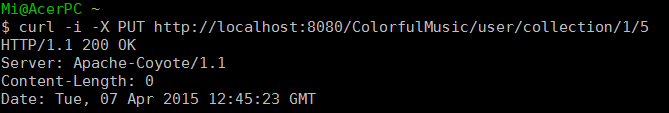

<h1 style="text-align: center">ColorfulMusic</h1>
<h3 style="text-align: center">不一样的音乐，不一样的色彩</h3>
#### 数据库注意事项
1. 为了方便，你可以直接简单地在你的 MySQL 数据库中添加 'cm' 用户，密码为 'cm'：
 GRANT ALL PRIVILEGES  ON \*.* TO 'cm'@'localhost' IDENTIFIED BY 'cm';
 FLUSH PRIVILEGES;
2. 导入数据库：
 SOURCE db.sql
3. 然后自行插入一些数据（比较麻烦，建议队友们写个小程序）
 

#### 目前提供的基本 API
*基础路径： http://localhost:8080/ColorfulMusic，数据格式为 JSON*

* 获得歌曲
    1. 获得 id 为 1 的歌曲：curl http://localhost:8080/ColorfulMusic/song/1
    2. 获得 id 0 之后的 3 首歌曲（id 分别为 1,2,3）：curl http://localhost:8080/ColorfulMusic/song/1/3
* 获得用户信息
    1. 获得 id 为 1 的用户的信息：curl http://localhost:8080/ColorfulMusic/user/1
    2. 获得 id 为 1 的用户收藏的歌曲：curl http://localhost:8080/ColorfulMusic/user/1/collection
* 获得歌手信息
    1. 获得 id 为 1 的歌手信息：curl http://localhost:8080/ColorfulMusic/singer/1

* 用户注册；方法：POST；路径：/user/user_register；注册成功返回Http状态码201和对应的用户信息

* 用户登录；方法：GET；路径：/user/user_login；登录成功返回Http状态码200和对应的用户 ID，否则返回状态码404

* 用户收藏歌曲；方法：PUT；路径：/user/collection/{userId}/{songId}；收藏成功返回Http状态码200
